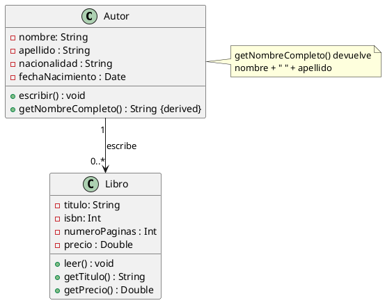

# Solución: Ejercicio 1 – Sistema de Libros y Autores

## Análisis del Problema

### Identificación de Clases

1. **Autor**
    - Representa a un autor que escribe libros.
    - Atributos (privados): nombre, apellido, nacionalidad, fechaNacimiento.
    - Métodos (públicos):
        - `escribir() : void`
        - `getNombreCompleto() : String {derived}`
2. **Libro**
    - Representa un libro que puede ser leído.
    - Atributos (privados): titulo, isbn, numeroPaginas, precio.
    - Métodos (públicos):
        - `leer() : void`
        - `getTitulo() : String`
        - `getPrecio() : Double`


## Análisis de Relaciones

### Asociación Autor–Libro

- Nombre de la relación (rol en Autor → Libro): **“escribe”**.
- Cardinalidades:
    - Un **Autor** escribe 0..* Libros (puede no tener libros aún, o varios).
    - Cada **Libro** es escrito por **1** Autor.
- Justificación:
    - El enunciado dice “Un Autor escribe uno o varios Libros” y “Cada Libro es escrito por un único Autor”.


## Tabla de Roles y Cardinalidades

| Relación | Clase Origen | Rol Origen | Card. Origen | Clase Destino | Rol Destino | Card. Destino |
| :-- | :-- | :-- | :-- | :-- | :-- | :-- |
| Asociación | Autor | autor | 1 | Libro | escribe | 0..* |


## Decisiones de Diseño

### ¿Por qué getNombreCompleto es {derived}?

- No se guarda como atributo independiente.
- Se calcula a partir de `nombre + " " + apellido`.
- Por eso se marca `{derived}` y se explica en la nota.


### ¿Por qué los atributos son privados?

- Para cumplir encapsulación: acceso solo mediante métodos públicos (getters o comportamiento).


### ¿Por qué un único Autor por Libro?

- El enunciado simplifica el modelo a un solo autor por libro, aunque en la realidad pueda haber varios.
- Se refleja con la cardinalidad 1 en Autor desde el punto de vista de Libro.


## Código PlantUML



### Código Kotlin

```kotlin
class Autor(
    private val nombre: String,
    private val apellido: String,
    private val nacionalidad: String,
    private val fechaNacimiento: java.util.Date
) {
    private val libros: MutableList<Libro> = mutableListOf()

    fun escribir() {
    }

    fun getNombreCompleto(): String {
        return ""
    }
}

class Libro(
    private val titulo: String,
    private val isbn: Int,
    private val numeroPaginas: Int,
    private var precio: Double
) {
    fun leer() {
    }

    fun getTitulo(): String {
        return ""
    }

    fun getPrecio(): Double {
        return 0.0
    }
}

```