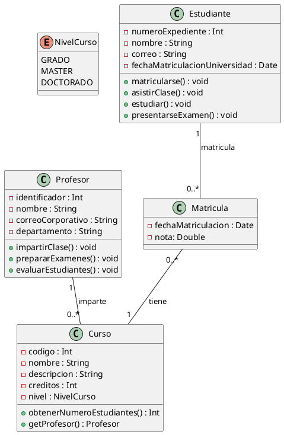

# Solución: Ejercicio 2 – Sistema de Gestión de Cursos Universitarios

## Análisis del Problema

### Identificación de Clases

1. Curso
    - Representa una asignatura/cursos de la universidad.
    - Atributos (privados):
        - codigo : Int
        - nombre : String
        - descripcion : String
        - creditos : Int
        - nivel : NivelCurso (enum: GRADO, MASTER, DOCTORADO)
    - Métodos (públicos):
        - obtenerNumeroEstudiantes() : Int
        - getProfesor() : Profesor
2. Profesor
    - Representa a un docente de la universidad.
    - Atributos (privados):
        - identificador : Int
        - nombre : String
        - correoCorporativo : String
        - departamento : String
    - Métodos (públicos):
        - impartirClase() : void
        - prepararExamenes() : void
        - evaluarEstudiantes() : void
3. Estudiante
    - Representa a un alumno matriculado en la universidad.
    - Atributos (privados):
        - numeroExpediente : Int
        - nombre : String
        - correo : String
        - fechaMatriculacionUniversidad : Date
    - Métodos (públicos):
        - matricularse() : void
        - asistirClase() : void
        - estudiar() : void
        - presentarseExamen() : void
4. Matricula (clase de asociación)
    - Representa la inscripción de un Estudiante en un Curso concreto.
    - Atributos (privados):
        - fechaMatriculacion : Date
        - nota : Double
5. NivelCurso (enum)
    - GRADO, MASTER, DOCTORADO.

## Análisis de Relaciones

1) Profesor–Curso (1:N)

- Un Profesor puede impartir 0..* Cursos.
- Cada Curso tiene 1 Profesor responsable.
- En tu diagrama:
    - Profesor "1" -- "0..*" Curso : imparte

2) Estudiante–Curso a través de Matricula (N:M con clase de asociación)

- Un Estudiante puede matricularse en 0..* Matriculas.
- Cada Matricula corresponde a 1 Curso.
- La relación Estudiante–Curso no es directa, se modela mediante Matricula, que guarda fecha y nota.
- En tu diagrama:
    - Estudiante "1" -- "0..*" Matricula : matricula
    - Matricula "0..*" -- "1" Curso : tiene

Esto captura:

- N:M entre Estudiante y Curso.
- Atributos propios de la relación (fechaMatriculacion, nota).


## Tabla de Roles y Cardinalidades

| Relación | Clase Origen | Rol Origen | Card. Origen | Clase Destino | Rol Destino | Card. Destino |
| :-- | :-- | :-- | :-- | :-- | :-- | :-- |
| Asociación | Profesor | profesor | 1 | Curso | imparte | 0..* |
| Asociación | Estudiante | estudiante | 1 | Matricula | matricula | 0..* |
| Asociación | Matricula | matricula | 0..* | Curso | curso | 1 |

(La N:M entre Estudiante y Curso se deduce combinando Estudiante–Matricula y Matricula–Curso.)

## Decisiones de Diseño

1) ¿Por qué Matricula como clase de asociación?

- La matrícula no es solo “Estudiante está en Curso”.
- Tiene datos propios: fechaMatriculacion, nota.
- Por eso se modela como entidad/clase que conecta Estudiante y Curso.

2) ¿Por qué enum NivelCurso?

- El nivel solo admite tres valores claros (GRADO, MASTER, DOCTORADO).
- Un enum evita errores de texto y representa mejor el dominio.

3) ¿Dónde poner los comportamientos?

- Acciones de Profesor (impartir, prepararExamenes, evaluarEstudiantes) están en Profesor.
- Acciones de Estudiante (matricularse, asistir, estudiar, presentarseExamen) están en Estudiante.
- Curso tiene obtenerNumeroEstudiantes(), que se puede implementar contando Matriculas asociadas.


## Código PlantUML



## Código Kotlin
```kotlin

enum class NivelCurso {
    GRADO,
    MASTER,
    DOCTORADO
}

class Curso(
    private val codigo: Int,
    private val nombre: String,
    private val descripcion: String,
    private val creditos: Int,
    private val nivel: NivelCurso,
    private val profesor: Profesor
) {
    private val matriculas: MutableList<Matricula> = mutableListOf()

    fun obtenerNumeroEstudiantes(): Int {
        return 0
    }

    fun getProfesor(): Profesor {
        return profesor
    }
}

class Profesor(
    private val identificador: Int,
    private val nombre: String,
    private val correoCorporativo: String,
    private val departamento: String
) {
    private val cursos: MutableList<Curso> = mutableListOf()

    fun impartirClase() { }

    fun prepararExamenes() { }

    fun evaluarEstudiantes() { }
}

class Estudiante(
    private val numeroExpediente: Int,
    private val nombre: String,
    private val correo: String,
    private val fechaMatriculacionUniversidad: java.util.Date
) {
    private val matriculas: MutableList<Matricula> = mutableListOf()

    fun matricularse() { }

    fun asistirClase() { }

    fun estudiar() { }

    fun presentarseExamen() { }
}

class Matricula(
    private val fechaMatriculacion: java.util.Date,
    private val nota: Double,
    private val curso: Curso,
    private val estudiante: Estudiante
)


```
