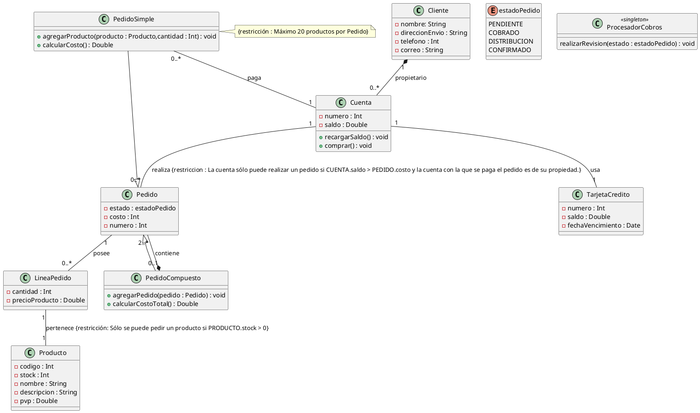

# Solución: Ejercicio 3 – Sistema de Gestión de Pedidos E-Commerce

## Análisis del Problema

### Identificación de Clases

1. **Cliente**
    - Representa a la persona que compra en la tienda.
    - Atributos: nombre, direccionEnvio, telefono, correo.
2. **Cuenta**
    - Monedero electrónico de un cliente.
    - Atributos: numero, saldo.
    - Métodos: recargarSaldo(), comprar().
3. **TarjetaCredito**
    - Medio de recarga y pago.
    - Atributos: numero, saldo, fechaVencimiento.
4. **Producto**
    - Artículo del inventario.
    - Atributos: codigo, nombre, descripcion, stock, pvp.
5. **Pedido** (abstracta)
    - Pedido genérico, heredan los tipos.
    - Atributos: estado, costo, numero.
    - Subclases:
        - **PedidoSimple**
            - Métodos: agregarProducto(), calcularCosto().
        - **PedidoCompuesto**
            - Métodos: agregarPedido(), calcularCostoTotal().
6. **LineaPedido**
    - Detalle de producto y cantidad de un pedido.
    - Atributos: cantidad, precioProducto.
7. **ProcesadorCobros** (Singleton)
    - Clase única para cobrar pedidos.
    - Métodos: realizarRevision(estado).
8. **estadoPedido** (enum)
    - PENDIENTE, COBRADO, DISTRIBUCION, CONFIRMADO.

## Análisis de Relaciones

### 1. Cliente–Cuenta (Composición)

- Un Cliente puede tener una o varias Cuentas.
- Justificación: El cliente puede eliminarse con todas sus cuentas.


### 2. Cuenta–Pedido

- Una Cuenta realiza varios Pedidos.
- Restricción: Solo si la Cuenta tiene saldo suficiente y es del Cliente dueño del Pedido.


### 3. Cuenta–Tarjeta

- Una Cuenta está asociada a una única Tarjeta de Crédito.


### 4. Pedido–PedidoSimple/PedidoCompuesto (Herencia, Composite)

- PedidoCompuesto *contiene* 2 o más Pedidos (simula arbol jerárquico de pedidos).


### 5. PedidoSimple–Cuenta (Pago)

- PedidoSimple se paga siempre con una única Cuenta.


### 6. Pedido–LineaPedido–Producto (Clase de asociación)

- LíneaPedido vincula Pedido y Producto, incluyendo cantidad, precio en el momento.
- Restricción: Solo si producto stock > 0.

## Tabla de Roles y Cardinalidades

| Relación | Clase Origen | Rol Origen | Card.Origen | Clase Destino | Rol Destino | Card.Destino |
| :-- | :-- | :-- | :-- | :-- | :-- | :-- |
| Composición | Cliente | propietario | 1 | Cuenta |  | 0..* |
| Asociación | Cuenta |  | 1 | TarjetaCredito |  | 1 |
| Asociación | Cuenta |  | 1 | Pedido |  | 0..* |
| Generalización | Pedido |  | 1 | PedidoSimple |  | 0..* |
| Generalización | Pedido |  | 1 | PedidoCompuesto |  | 0..* |
| Composición (Composite) | PedidoCompuesto | contiene | 0..1 | Pedido | contenido | 2..* |
| Asociación | PedidoSimple | paga | 0..* | Cuenta |  | 1 |
| Agregación | Pedido | posee | 1 | LineaPedido |  | 0..* |
| Asociación | LineaPedido | pertenece | 1 | Producto |  | 1 |


## Decisiones de Diseño

### ¿Por qué PedidoCompuesto?

Permite estructurar jerarquías de pedidos, esencial para pedidos agrupados, envíos parciales, o gestión avanzada.

### ¿Por qué clase LineaPedido?

Encapsula producto, cantidad y precio en el momento del pedido. Es una clase de asociación entre Producto y Pedido.

### ¿Restricciones en compras y stock?

Obliga que el pedido solo se realice si:

- La cuenta tiene saldo suficiente.
- El producto pedido tiene stock disponible.
- El cliente solo paga con cuentas propias.


### ¿Singleton en ProcesadorCobros?

Solo debe haber un encargado de cobrar pedidos, controlando las transacciones y el pase de estado.

## Diagrama de Clases PlantUML



## Código Kotlin

```kotlin
enum class EstadoPedido {
    PENDIENTE,
    COBRADO,
    DISTRIBUCION,
    CONFIRMADO
}

class Cliente(
    private val nombre: String,
    private val direccionEnvio: String,
    private val telefono: Int,
    private val correo: String
) {
    private val cuentas: MutableList<Cuenta> = mutableListOf()
}

class Producto(
    private val codigo: Int,
    private val stock: Int,
    private val nombre: String,
    private val descripcion: String,
    private val pvp: Double
)

class Cuenta(
    private val numero: Int,
    private var saldo: Double,
    private val cliente: Cliente
) {
    private val pedidos: MutableList<Pedido> = mutableListOf()
    private var tarjetaCredito: TarjetaCredito

    fun recargarSaldo() {
    }

    fun comprar() {
    }
}

class TarjetaCredito(
    private val numero: Int,
    private var saldo: Double,
    private val fechaVencimiento: java.util.Date,
    private val cuenta: Cuenta
)

open class Pedido(
    private val estado: EstadoPedido,
    private val costo: Int,
    private val numero: Int,
    private val cuenta: Cuenta
) {
    protected val lineas: MutableList<LineaPedido> = mutableListOf()
}

class LineaPedido(
    private val cantidad: Int,
    private val precioProducto: Double,
    private val producto: Producto,
    private val pedido: Pedido
)

class PedidoSimple(
    estado: EstadoPedido,
    costo: Int,
    numero: Int,
    cuenta: Cuenta
) : Pedido(estado, costo, numero, cuenta) {

    fun agregarProducto(producto: Producto, cantidad: Int) {
    }

    fun calcularCosto(): Double {
        return 0.0
    }
}

class PedidoCompuesto(
    estado: EstadoPedido,
    costo: Int,
    numero: Int,
    cuenta: Cuenta
) : Pedido(estado, costo, numero, cuenta) {

    private val pedidos: MutableList<Pedido> = mutableListOf()

    fun agregarPedido(pedido: Pedido) {
    }

    fun calcularCostoTotal(): Double {
        return 0.0
    }
}

object ProcesadorCobros {
    fun realizarRevision(estado: EstadoPedido) {
    }
}

```