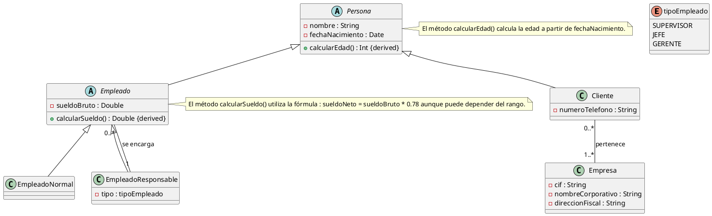

# Solución: Ejercicio 4 – Sistema de Gestión Empresarial

## Análisis del Problema

### Identificación de Clases

1. **Persona** (abstracta)
    - Datos comunes: nombre, fechaNacimiento.
    - Método derivado: calcularEdad().
2. **Empleado** (abstracta)
    - Hereda de Persona, añade sueldoBruto.
    - Método derivado: calcularSueldo().
    - **EmpleadoNormal** (subclase de Empleado)
    - **EmpleadoResponsable** (subclase de Empleado)
        - Atributo: tipo (SUPERVISOR/JEFE/GERENTE).
3. **Cliente** (hereda de Persona)
    - Añade númeroTelefono.
4. **Empresa**
    - CIF, nombre corporativo, dirección fiscal.
5. **Enum tipoEmpleado**
    - SUPERVISOR, JEFE, GERENTE.

## Análisis de Relaciones

### 1. Herencia

- Persona es supertipo para Empleado y Cliente.
- Empleado es supertipo para EmpleadoNormal y EmpleadoResponsable.

### 2. Asociación reflexiva (jerarquía empleados)

- Un EmpleadoResponsable se encarga de 0..* Empleados.
    - Refleja jerarquía interna y cadena de mando.

### 3. Asociación Cliente–Empresa

- Un Cliente pertenece a 1..* Empresas.
- Una Empresa tiene 0..* Clientes.
- Restricción: todo Cliente debe estar vinculado, como mínimo, a una Empresa.

## Tabla de Roles y Cardinalidades

| Relación | Clase Origen | Rol Origen | Card.Origen | Clase Destino | Rol Destino | Card.Destino |
| :-- | :-- | :-- | :-- | :-- | :-- | :-- |
| Herencia | Persona |  |  | Cliente |  |  |
| Herencia | Persona |  |  | Empleado |  |  |
| Herencia | Empleado |  |  | EmpleadoNormal |  |  |
| Herencia | Empleado |  |  | EmpleadoResponsable |  |  |
| Reflexiva responsable | EmpleadoResponsable | se encarga | 1 | Empleado | subordinado | 0..* |
| Asociación comercial | Cliente | pertenece | 0..* | Empresa |  | 1..* |

## Decisiones de Diseño

### ¿Por qué Persona es abstracta?

Permite factorizar los datos comunes y el método derivado de edad, evitando duplicación en Cliente y Empleado.

### ¿Por qué EmpleadoResponsable y EmpleadoNormal?

Refleja la diferenciación jerárquica y permite modelar las cadenas de mando.

### ¿Por qué reflexiva sólo en EmpleadoResponsable?

Según el enunciado, sólo los responsables tienen subordinados. Para escenarios con jerarquías más complejas, se usaría la asociación reflexiva directa en Empleado.

### ¿Por qué Cliente pertenece a al menos una Empresa?

La empresa no trabaja con particulares, así que todo cliente debe estar asociado a una o más empresas.

## Diagrama de Clases PlantUML

## Conceptos Clave de UML Aplicados

1. **Herencia**: Factorización de datos comunes en Persona.
2. **Especialización**: Subtipos de Empleado (Normal/Responsable).
3. **Encapsulación**: Atributos privados, métodos públicos.
4. **Métodos derivados**: Edad y sueldo neto calculados.
5. **Asociación reflexiva**: Jerarquía en EmpleadoResponsable.
6. **Restricciones**: Cliente debe pertenecer a al menos una empresa.