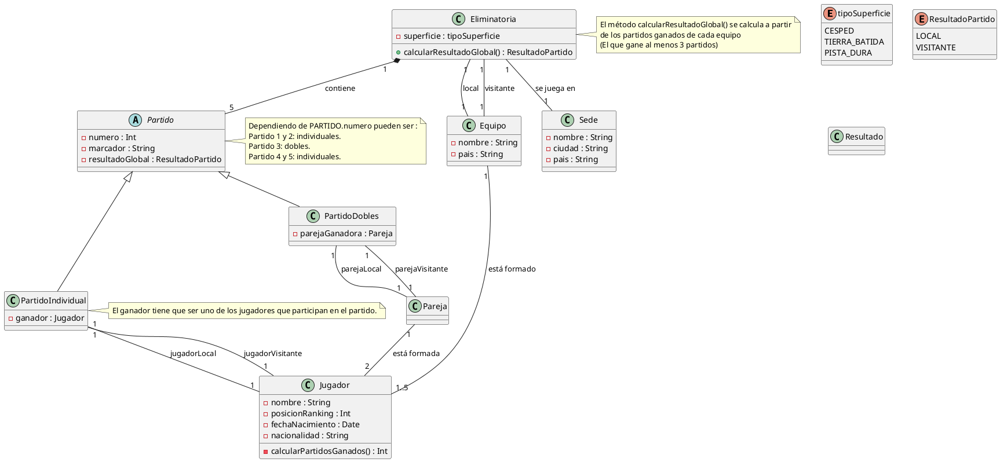

# Solución: Ejercicio 7 – Sistema de Gestión de la Copa Davis

## Análisis del Problema

### Identificación de Clases

1. **Equipo**
    - Atributos: nombre, pais.
    - Representa a la selección nacional.
2. **Jugador**
    - Atributos: nombre, posicionRanking, fechaNacimiento, nacionalidad.
    - Método: calcularPartidosGanados() : Int.
3. **Eliminatoria**
    - Atributos: superficie : tipoSuperficie.
    - Métodos: calcularResultadoGlobal() : ResultadoPartido.
4. **Partido** (abstracta)
    - Atributos: numero, marcador, resultadoGlobal : ResultadoPartido.
    - Subclases:
        - **PartidoIndividual**
            - Atributos: ganador : Jugador.
        - **PartidoDobles**
            - Atributos: parejaGanadora : Pareja.
5. **Pareja**
    - Representa una pareja de dobles (2 jugadores).
6. **Sede**
    - Atributos: nombre, ciudad, pais.
7. **Enumeraciones**
    - tipoSuperficie: CESPED, TIERRA_BATIDA, PISTA_DURA.
    - ResultadoPartido: LOCAL, VISITANTE.

## Análisis de Relaciones

1. **Eliminatoria–Partido (Composición fuerte)**
    - Una Eliminatoria contiene exactamente 5 Partidos.
    - `Eliminatoria "1" *-- "5" Partido : contiene`
2. **Eliminatoria–Equipo**
    - Dos equipos por eliminatoria:
    - `Eliminatoria "1" -- "1" Equipo : local`
    - `Eliminatoria "1" -- "1" Equipo : visitante`
3. **Equipo–Jugador**
    - Un Equipo está formado por 1..5 Jugadores en esa eliminatoria:
    - `Equipo "1" -- "1..5" Jugador : está formado`
4. **Eliminatoria–Sede**
    - Una Eliminatoria se juega en una Sede:
    - `Eliminatoria "1" -- "1" Sede : se juega en`
5. **Pareja–Jugador**
    - Una Pareja está formada por 2 Jugadores:
    - `Pareja "1" -- "2" Jugador : está formada`
6. **Herencia Partido–Subclases**
    - `Partido <|-- PartidoIndividual`
    - `Partido <|-- PartidoDobles`
7. **PartidoDobles–Pareja**
    - Dos parejas en cada dobles:
    - `PartidoDobles "1" -- "1" Pareja : parejaLocal`
    - `PartidoDobles "1" -- "1" Pareja : parejaVisitante`
8. **PartidoIndividual–Jugador**
    - Dos jugadores por partido individual:
    - `PartidoIndividual "1" -- "1" Jugador : jugadorLocal`
    - `PartidoIndividual "1" -- "1" Jugador : jugadorVisitante`

## Tabla de Roles y Cardinalidades

| Relación | Clase Origen | Rol Origen | Card.Origen | Clase Destino | Rol Destino | Card.Destino |
| :-- | :-- | :-- | :-- | :-- | :-- | :-- |
| Composición | Eliminatoria | contiene | 1 | Partido |  | 5 |
| Asociación | Eliminatoria | local | 1 | Equipo |  | 1 |
| Asociación | Eliminatoria | visitante | 1 | Equipo |  | 1 |
| Asociación | Equipo | está formado | 1 | Jugador |  | 1..5 |
| Asociación | Eliminatoria | se juega en | 1 | Sede |  | 1 |
| Asociación | Pareja | está formada | 1 | Jugador |  | 2 |
| Generalización | Partido |  | 1 | PartidoIndividual |  | 0..* |
| Generalización | Partido |  | 1 | PartidoDobles |  | 0..* |
| Asociación | PartidoDobles | parejaLocal | 1 | Pareja |  | 1 |
| Asociación | PartidoDobles | parejaVisitante | 1 | Pareja |  | 1 |
| Asociación | PartidoIndividual | jugadorLocal | 1 | Jugador |  | 1 |
| Asociación | PartidoIndividual | jugadorVisitante | 1 | Jugador |  | 1 |


## Decisiones de Diseño

1. **Partido abstracta**
    - No existe un partido “genérico”; siempre es Individual o Dobles.
    - Partido agrupa atributos comunes: numero, marcador, resultadoGlobal.
2. **Enumeraciones**
    - tipoSuperficie y ResultadoPartido evitan valores libres y recogen reglas del dominio.
3. **Composición fuerte Eliminatoria–Partido**
    - Los Partidos solo existen dentro de una Eliminatoria concreta.
    - La cardinalidad 5 fuerza el formato (4 individuales + 1 dobles).
4. **Roles local/visitante**
    - Tanto para equipos como para parejas/jugadores, útil para resultados y estadísticas.
5. **Reglas de negocio**
    - Máximo 5 jugadores por Equipo (1..5).
    - Método calcularResultadoGlobal() en Eliminatoria: cuenta partidos ganados y decide ganador (primero a 3).
    - Nota en Partido: mapea numero de partido → tipo (1–2 individuales, 3 dobles, 4–5 individuales).
    - Nota en PartidoIndividual: el ganador debe ser uno de los jugadores que participan.

## Diagrama de Clases (tu PlantUML)



## Código en Kotlin
```kotlin
enum class TipoSuperficie {
    CESPED,
    TIERRA_BATIDA,
    PISTA_DURA
}

enum class ResultadoPartido {
    LOCAL,
    VISITANTE
}
class Equipo(
    private val nombre: String,
    private val pais: String
) {
    private val jugadores: MutableList<Jugador> = mutableListOf()
}

class Jugador(
    private val nombre: String,
    private val posicionRanking: Int,
    private val fechaNacimiento: java.util.Date,
    private val nacionalidad: String
) {
    fun calcularPartidosGanados(): Int {
        return 0
    }
}

class Pareja(
    private val jugador1: Jugador,
    private val jugador2: Jugador
)

class Sede(
    private val nombre: String,
    private val ciudad: String,
    private val pais: String
)

class Eliminatoria(
    private val superficie: TipoSuperficie,
    private val equipoLocal: Equipo,
    private val equipoVisitante: Equipo,
    private val sede: Sede
) {
    private val partidos: MutableList<Partido> = mutableListOf()

    fun calcularResultadoGlobal(): ResultadoPartido {
        return ResultadoPartido.LOCAL
    }
}

abstract class Partido(
    private val numero: Int,
    private val marcador: String,
    protected var resultadoGlobal: ResultadoPartido
)

class PartidoIndividual(
    numero: Int,
    marcador: String,
    resultadoGlobal: ResultadoPartido,
    private val jugadorLocal: Jugador,
    private val jugadorVisitante: Jugador,
    private val ganador: Jugador
) : Partido(numero, marcador, resultadoGlobal)


class PartidoDobles(
    numero: Int,
    marcador: String,
    resultadoGlobal: ResultadoPartido,
    private val parejaLocal: Pareja,
    private val parejaVisitante: Pareja,
    private val parejaGanadora: Pareja
) : Partido(numero, marcador, resultadoGlobal)

```