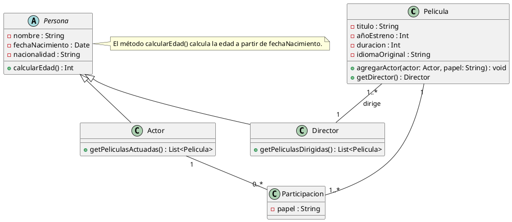

# Solución: Ejercicio 9 - Sistema Gestión de Películas

## Análisis del Problema

### Identificación de Clases

Del análisis de las especificaciones, identificamos estas clases clave:

1. **Pelicula**
    - Representa una película del catálogo.
    - Atributos: título, añoEstreno, duracion, idiomaOriginal.
    - Métodos: agregarActor(), getDirector().
2. **Persona** (abstracta)
    - Contiene los datos comunes a actores y directores.
    - Atributos: nombre, fechaNacimiento, nacionalidad.
    - Métodos: calcularEdad().
3. **Actor** (especialización de Persona)
    - Representa a cada actor del sistema.
    - Métodos: getPeliculasActuadas().
4. **Director** (especialización de Persona)
    - Representa a cada director del sistema.
    - Métodos: getPeliculasDirigidas().
5. **Participacion** (clase de asociación)
    - Relaciona Actor y Pelicula con el papel concreto.
    - Atributos: papel (nombre del personaje interpretado).

## Análisis de Relaciones

### 1. Herencia (Persona - Actor/Director)

- **Tipo**: Especialización.
- **Justificación**: Actor y Director son personas con información común.

### 2. Asociación Director–Pelicula (1:N)

- Película tiene un único Director.
- Un Director puede dirigir muchas (o ninguna) Películas.

### 3. Asociación Actor–Pelicula a través de Participacion (N:M)

- Muchos actores pueden participar en muchas películas.
- Cada participación concreta vincula a un actor con su papel en una película.
- Se representa mediante la clase de asociación Participacion.

## Tabla de Roles y Cardinalidades

| Relación | Clase Origen | Rol Origen | Cardinalidad Origen | Clase Destino | Rol Destino | Cardinalidad Destino |
| :-- | :-- | :-- | :-- | :-- | :-- | :-- |
| Herencia | Persona | - | - | Actor | - | - |
| Herencia | Persona | - | - | Director | - | - |
| Asociación | Pelicula | película | 1 | Director | dirige | 1 |
| Participación | Actor | actor | 1 | Participacion | participa en | 0..* |
| Participación | Pelicula | película | 1 | Participacion | contiene | 1..* |

## Decisiones de Diseño

### ¿Por qué usar una clase de asociación Participacion?

Permite registrar el **papel** interpretado por cada actor en cada película. Es necesario porque el papel varía entre películas, no es atributo ni del actor ni de la película por sí sola.

### ¿Por qué Persona como superclase?

Tanto actores como directores comparten los mismos atributos básicos. Se evita duplicidad y facilita métodos reutilizables como calcularEdad().

### ¿Por qué las asociaciones así?

- Película: debe tener **mínimo un actor** y **un director**.
- Actor y Director pueden estar en ninguna, una o muchas películas.

## Diagrama de Clases UML (PlantUML)

## Conceptos Clave Aplicados

1. **Herencia**: Una Persona puede ser Actor o Director.
2. **Clase de Asociación**: Participacion permite relación N:M entre Actor y Pelicula, añadiendo el papel.
3. **Cardinalidades**: Una película tiene 1 director, 1..* actores y los actores pueden estar en múltiples películas.
